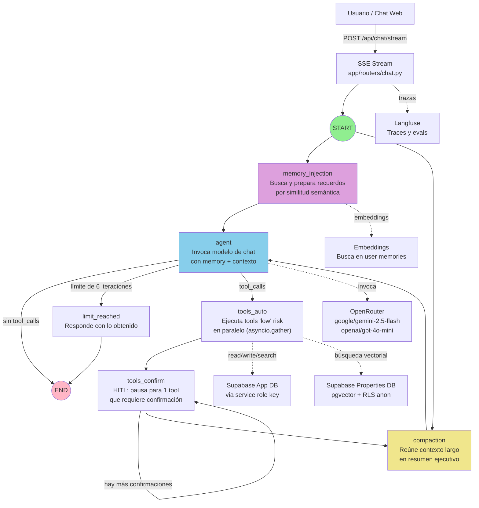
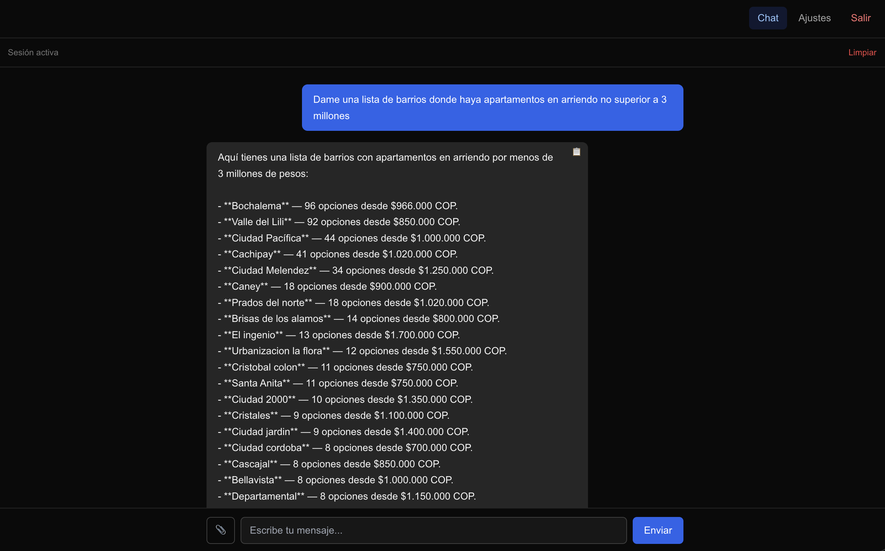
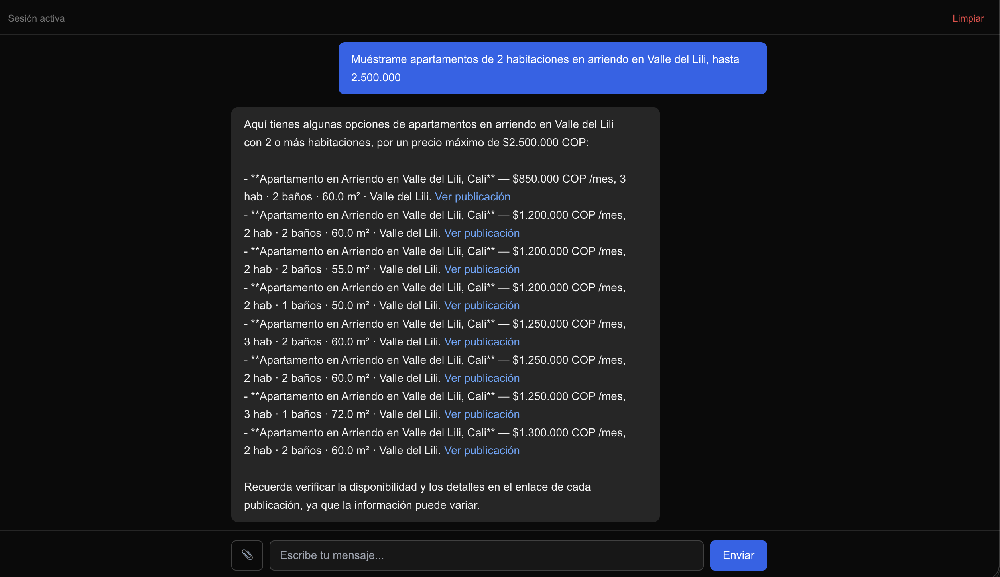
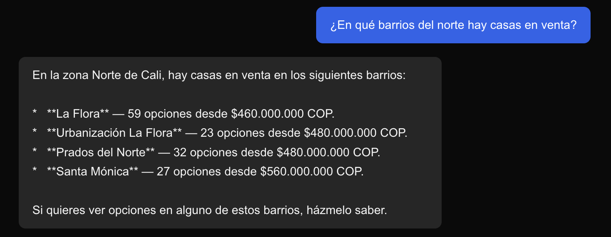

# Lab10 Project — Agente Inmobiliario Cali

Agente conversacional especializado en búsqueda de apartamentos y casas en arriendo y venta en
Cali, Colombia. Chat web con memoria de largo plazo, confirmación humana (HITL) para acciones
riesgosas, y dos herramientas de búsqueda de propiedades (`search_properties` y
`list_neighborhoods`) contra una base de datos separada con búsqueda vectorial (pgvector).
Stack: FastAPI + LangGraph + Supabase + OpenRouter + Langfuse, UI SSR en Jinja2/HTMX.

## Arquitectura y flujo

El agente ejecuta un grafo LangGraph que inyecta memoria de largo plazo, realiza compactación de contexto, invoca el modelo de chat, y ejecuta herramientas con confirmación humana cuando sea necesario:



**Flujo clave:**
- `memory_injection` y `compaction` corren en paralelo desde START.
- `agent` espera a ambos, invoca el modelo con system prompt + memoria inyectada + contexto compactado.
- Si hay `tool_calls`, `tools_auto` ejecuta tools de riesgo bajo en paralelo.
- `tools_confirm` pausa (con `interrupt()`) para confirmación humana de UNA tool por invocación.
- Si el batch tiene 2+ tools que requieren confirmación, `route_after_confirm` rutea de vuelta a `tools_confirm`.
- Cerrado el batch, `compaction` y `agent` corren nuevamente en la siguiente ronda.
- Max 6 iteraciones de herramientas por turno; después, `limit_reached` corta el loop.

## Requisitos previos

- Python >= 3.11
- [uv](https://docs.astral.sh/uv/) para gestionar el entorno y las dependencias
- Node.js (para correr los tests de `tests/js/`)
- Una cuenta/proyecto de [Supabase](https://supabase.com) (Postgres + Auth)
- Una cuenta de [OpenRouter](https://openrouter.ai) (acceso a los modelos de chat)

## Capacidades principales

- **Autenticación y onboarding**: login, signup, onboarding de 4 pasos (perfil, agente, herramientas, revisión).
- **Chat multi-sesión**: sidebar con sesiones, título automático por LLM, archivado y eliminación.
- **Memoria de largo plazo**: 3 tipos (episódica, semántica, procedural), inyectada en cada turno del agent, con filtro de privacidad.
- **Compactación inteligente**: dos etapas para conversaciones largas, circuit breaker con fallback.
- **Herramientas extensibles**: catálogo + adapters, sin tocar el grafo. Punto de extensión MCP.
- **Confirmación humana (HITL)**: obligatoria para acciones de riesgo medio/alto, con auditoria de todas las tool calls.
- **Adjuntos multimodales**: soporte de imágenes en chat, validación de tipo y tamaño en cliente y servidor.
- **Búsqueda de propiedades**: dos modos —
  - `search_properties`: listados individuales por filtros estructurados (barrio, precio, habitaciones, estrato, etc.) combinados con búsqueda vectorial semántica cuando el usuario describe algo cualitativo.
  - `list_neighborhoods`: descubrimiento agregado por barrio (conteo + precio mínimo), sin listar propiedades individuales.
  - Ambas contra base de datos separada Supabase (solo lectura, anon key, RLS).
- **Base de datos de propiedades con búsqueda embebida (pgvector)**: además de filtros SQL exactos, `search_properties` genera embedding de consultas cualitativas del usuario (amenities, estilo, cercanías en lenguaje natural) y rankea resultados por similitud semántica (cosine distance) contra embeddings de propiedades. Ver `docs/technical-brief.md`, sección "Cómo se consultan los datos", para detalle de RPCs, tablas y mecanismo de búsqueda.
- **Selector de modelo**: usuarios eligen entre gemini-2.5-flash (primario) y gpt-4o-mini (fallback).
- **Trazabilidad**: trazas opcionales vía Langfuse para cada run del agente.
- **Blindaje contra inyección de prompts**: contexto de perfil + memoria envueltos en markers explícitos que instruyen al modelo a no tratarlos como órdenes; guardrails de confidencialidad server-side en TODO system prompt; en el cliente, solo URLs `https://` se hacen clickeables; HITL obligatorio para acciones sensibles.

## Ejemplos de uso — cómo probar el agente

Los siguientes ejemplos validan las funcionalidades principales del agente. Asumen que el usuario tiene configurado el system prompt de `docs/agent-system-prompt.md` (o uno similar enfocado en búsqueda inmobiliaria en Cali) — con el prompt genérico por defecto ("Eres un asistente útil."), el comportamiento específico de zonas y selección de tools no aplica.

**Nota:** Estos ejemplos complementan las pruebas automatizadas (`pytest`, `npm run test:js`); su propósito es validar end-to-end el comportamiento del agent, no reemplazarlas.

### a) Agregación por barrios (list_neighborhoods)

**Escribí en el chat:**
```
Dame una lista de barrios donde haya apartamentos en arriendo no superior a 3 millones
```

**Comportamiento esperado:**
- El agente invoca `list_neighborhoods` (no `search_properties`), sin listar propiedades individuales.
- Respuesta: tabla de barrios con cantidad de opciones + precio mínimo en cada zona.
- Si el dataset tiene barrios bajo ese precio, aparecen agrupados.

### b) Pregunta ambigua — cómo el agente maneja zonas sin barrio específico

**Escribí en el chat:**
```
Busco algo para arrendar en el sur de Cali
```

**Comportamiento esperado:**
- "Sur" es una zona del system prompt, no un barrio filtrable directamente.
- El agente pregunta por un barrio concreto ("¿Cuál de estos barrios del sur te interesa? Ciudad Jardín, Militar, El Lido...") en lugar de buscar "sur" como string literal en los filtros.

### c) Búsqueda detallada con filtros (search_properties)

**Escribí en el chat:**
```
Muéstrame apartamentos de 2 habitaciones en arriendo en Valle del Lili, hasta 2.500.000
```

**Comportamiento esperado:**
- El agente invoca `search_properties` con filtros estructurados: `operation_type: "arriendo"`, `property_type: "apartamento"`, `min_bedrooms: 2`, `neighborhood: "Valle del Lili"`, `max_price_cop: 2500000`.
- Respuesta: propiedades individuales con detalles (precio, descripción, link), prácticamente sin reescribir el markdown devuelto por la tool.

### d) Validación de zonas — no inferir sin tabla

**Escribí en el chat:**
```
¿En qué barrios del norte hay casas en venta?
```

**Comportamiento esperado:**
- El agente invoca `list_neighborhoods` con filtro `operation_type: "venta"`, `property_type: "casa"`.
- Cruza los barrios devueltos contra la tabla de zonas del system prompt (`[ZONAS DE CALI]`).
- Menciona zona "Norte" **solo** para barrios que aparecen explícitamente en la sección `Norte:` de esa tabla.
- Nunca infiere zona del nombre del barrio (ej. "Prados de Oriente" no asume zona "Oriente" si no está en la tabla).

### e) Límite de alcance — rechazo gentil de asesoría fuera de alcance

**Escribí en el chat:**
```
¿Me conviene pedir un crédito hipotecario o pagar de contado?
```

**Comportamiento esperado:**
- El agente declina dar asesoría financiera/legal (fuera de alcance del system prompt `[ALCANCE]`).
- Redirige hacia búsqueda de propiedades: "No asesoro sobre hipotecas o financiamiento. ¿Querés que te ayude a encontrar propiedades en tu rango de precio?"

### f) Búsqueda embebida por descripción cualitativa (semantic_query)

**Escribí en el chat:**
```
Busco un apartamento amplio, con buena iluminación natural, en un edificio moderno y cerca de un centro comercial
```

**Comportamiento esperado:**
- El agente invoca `search_properties` con `semantic_query` (campo cualitativo) en lugar de forzar atributos en filtros estructurados inexistentes.
- Backend genera embedding de "amplio, iluminación natural, moderno, centro comercial" y rankea resultados por similitud semántica (pgvector cosine distance) contra `property_embeddings`.
- Respuesta: propiedades relevantes por descripción, no solo por coincidencia de keywords.

**Nota sobre ejemplos (a) a (f):** Los ejemplos (a) a (e) ejercitan solo consultas con filtros SQL estructurados (barrio, precio, habitaciones, operation_type, property_type). El ejemplo (f) es el único que ejercita también el modo de búsqueda embebida (semantic_query + pgvector ranking). Para detalle técnico de ambos modos, ver sección "Cómo se consultan los datos" en `docs/technical-brief.md`.

## Capturas de pantalla

### Agregación por barrios (list_neighborhoods)



Corresponde al ejemplo (a): el usuario solicita barrios con apartamentos en arriendo hasta cierto precio. El agente invoca `list_neighborhoods` y muestra resultados agrupados por barrio sin listar propiedades individuales.

### Desambiguación de zona sin barrio específico


Corresponde al ejemplo (b): el usuario menciona "sur de Cali" (zona genérica). El agente reconoce que "sur" no es un barrio filtrable y pide clarificación, sugiriendo opciones concretas de esa zona.

### Búsqueda detallada con filtros estructurados



Corresponde al ejemplo (c): búsqueda con filtros estructurados (habitaciones, precio, barrio, operación). El agente invoca `search_properties` y devuelve propiedades con precio, descripción y detalles.

### Validación de zonas contra tabla



Corresponde al ejemplo (d): búsqueda por zona (norte). El agente cruza los barrios devueltos contra la tabla de zonas del system prompt y menciona zona solo para barrios explícitamente listados, nunca inferidos del nombre.

## Instalación

```bash
git clone https://github.com/pablorodn/agent_personal.git
cd agent_total
uv sync --extra dev
npm install
```

`--extra dev` instala pytest, ruff y mypy además de las dependencias de la app. Si además
querés correr `scripts/check_connections.py` (verificación manual de conectividad), agregá
`--extra scripts` (usa `asyncpg`, no requerido por la app en sí):

```bash
uv sync --extra dev --extra scripts
```

## Configuración

Copiá `.env.example` a `.env` y completá las variables:

```bash
cp .env.example .env
```

| Variable | Uso |
| --- | --- |
| **Base de datos principal (obligatoria)** | |
| `SUPABASE_URL` | URL del proyecto Supabase |
| `SUPABASE_ANON_KEY` | Cliente anon de Supabase |
| `SUPABASE_SERVICE_ROLE_KEY` | Cliente de service-role, usado por el backend (auth, sesiones, mensajes, memoria, auditoría) |
| `DATABASE_URL` | Conexión directa a Postgres (checkpointing de LangGraph, determinista y confiable) |
| **Modelos de chat (obligatoria)** | |
| `OPENROUTER_API_KEY` | Gateway a múltiples modelos: primario (gemini-2.5-flash) + fallback (gpt-4o-mini) para chat; gemini-2.5-flash también para compactación/títulos |
| `SECRET_KEY` | Firma de la sesión HTTP (mínimo 32 caracteres) |
| **File tools (opcional)** | |
| `FILE_TOOLS_ENABLED` | `true`/`false`; habilita `read_file`/`write_file`/`edit_file` (fail-closed si falta o es ambiguo) |
| `FILE_TOOLS_ROOT` | Raíz de confinamiento (rechaza path traversal; todas las paths resueltas fuera de esta raíz generan PermissionError) |
| **Base de datos de propiedades (opcional)** | |
| `PROPERTIES_SUPABASE_URL` | URL de un proyecto Supabase separado, solo lectura, para búsqueda de propiedades (esquema en `migrations/properties_db/`) |
| `PROPERTIES_SUPABASE_ANON_KEY` | Anon key del proyecto de propiedades (nunca service role; RLS protege tablas) |
| `PROPERTIES_SUPABASE_SERVICE_ROLE_KEY` | Service role del proyecto de propiedades; solo para `scripts/backfill_property_embeddings.py` (proceso offline/manual, nunca en request path). Nunca importar desde `app/tools` o `app/agent` |
| **Observabilidad (opcional)** | |
| `LANGFUSE_PUBLIC_KEY` / `LANGFUSE_SECRET_KEY` | Trazas de LLM, agent runs, tool calls |
| `LANGFUSE_HOST` | Host de Langfuse (default `https://cloud.langfuse.com`) |
| **Misc (opcional)** | |
| `EVAL_USER_ID` | UUID de un `profiles.id` existente para `evals/run_faq_experiment.py` |
| `MCP_EXAMPLE_SERVER_URL` | Config ilustrativa del stub de referencia MCP |
| `ENVIRONMENT` | `development` (default) o `production`; controla `secure`/`https_only` en cookies |

Sin `SUPABASE_URL`, `SUPABASE_ANON_KEY`, `SUPABASE_SERVICE_ROLE_KEY`, `DATABASE_URL`,
`OPENROUTER_API_KEY` o `SECRET_KEY` la aplicación no arranca. `PROPERTIES_SUPABASE_URL` /
`PROPERTIES_SUPABASE_ANON_KEY` / `PROPERTIES_SUPABASE_SERVICE_ROLE_KEY` son opcionales: si
faltan, la app arranca igual y la tool de búsqueda de propiedades queda deshabilitada
mediante un error controlado.

**Cuidado**: si `.env` apunta a un proyecto Supabase real (no uno de prueba), cualquier
interacción con la app (login, mensajes de chat, etc.) escribe datos reales ahí.

## Base de datos

El esquema vive en `migrations/*.sql`, numeradas secuencialmente. No hay un runner
automatizado en el repo: aplicá cada archivo, en orden, contra tu proyecto Supabase — por
ejemplo desde el SQL Editor del dashboard de Supabase, o vía `psql`:

```bash
for f in migrations/*.sql; do psql "$DATABASE_URL" -f "$f"; done
```

Nunca modifiques una migración ya aplicada; los cambios de esquema posteriores van en un
archivo nuevo (`.cursor/.rules/guardrails.mdc`).

## Correr el servidor de desarrollo

```bash
uv run uvicorn app.main:app --port 8000 --host 127.0.0.1
```

No hay endpoint `/health`; usá `GET /login` (público, `200` cuando el server ya arrancó) para
chequear que está arriba. El log de arranque exitoso muestra `"event": "runtime_warmup"`
seguido de `Application startup complete.`; si en cambio aparece `runtime_warmup_failed`, el
pool del checkpointer no pudo conectar a `DATABASE_URL`.

## Tests

```bash
pytest tests/unit tests/integration tests/e2e
npm run test:js
```

## Lint y tipos

```bash
ruff check .
mypy app/
```

## Estructura del proyecto

```
app/routers/     rutas HTTP de API (chat, sesiones, auth)
app/pages/       rutas HTTP que renderizan páginas completas (chat, onboarding, settings)
app/agent/       runtime de LangGraph: grafo, checkpointer, compactación, memoria, modelo
app/tools/       catálogo de herramientas, schemas y handlers (adapters)
app/db/          acceso a Supabase y queries por tabla
app/services/    servicios transversales (HITL, adjuntos, política de memoria, onboarding)
app/middleware/  autenticación de requests
app/templates/   templates Jinja2 (páginas y partials HTMX)
app/static/js/   JS plano del cliente de chat (sin build step)
migrations/      esquema de Postgres, incremental
tests/           unit, integration, e2e (pytest) y tests/js (Node + jsdom)
evals/           evaluación del agente real contra casos de FAQ
scripts/         utilidades manuales (verificación de conectividad)
docs/            documentación de arquitectura y contrato de producto
```

## Documentación

| Documento | Qué describe |
| --- | --- |
| `docs/technical-brief.md` | Brief de producto: qué es `lab10_project` y qué hace |
| `docs/ui-design.md` | Contrato visual y HTMX de la UI |
| `docs/implementation-summary.md` | Cómo está construido en la práctica (mecanismos internos) |
| `docs/extending.md` | Guía para agregar herramientas o integraciones nuevas |
| `docs/mcp-extension-example.md` | Ejemplo de referencia del punto de extensión MCP |
| `migrations/*.sql` | Modelo de datos, fuente de verdad del esquema |
| `.cursor/.rules/*.mdc` | Reglas de arquitectura, seguridad, testing y colaboración |
